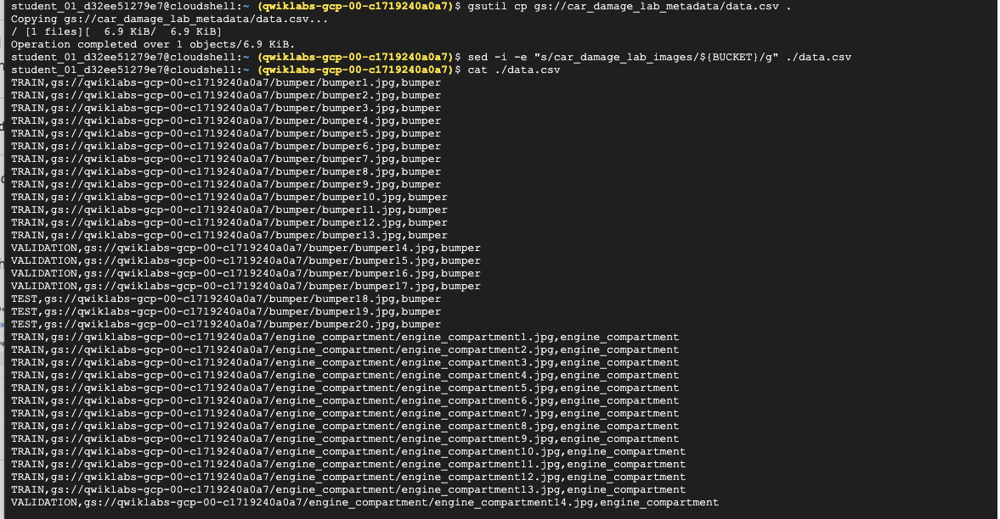
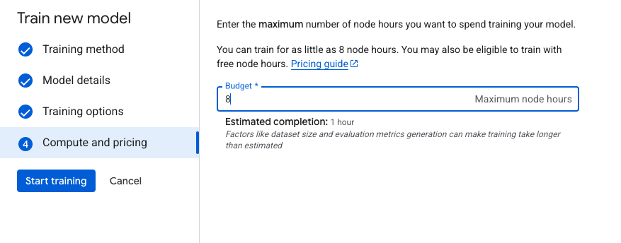
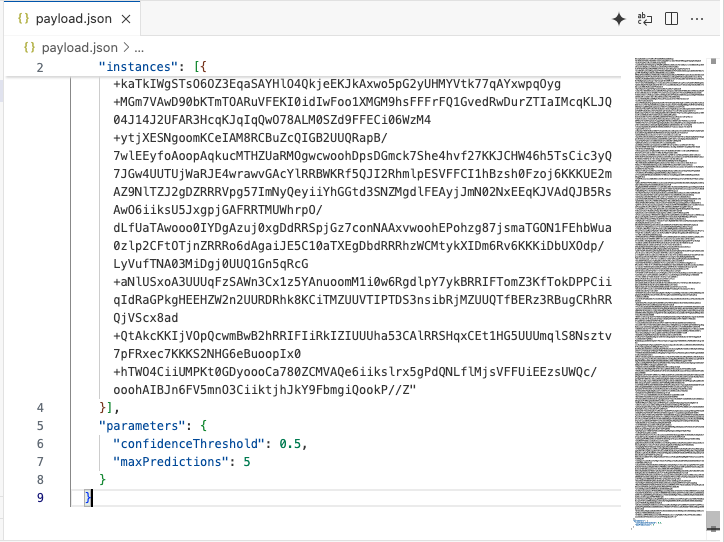

# GCP-LAB-Identify-Damaged-Car-Parts-with-Vertex-AutoML-Vision
Identify Damaged Car Parts with Vertex AutoML Vision

#### Overview

Vertex AI brings together the Google Cloud services for building ML under one, unified UI and API. In Vertex AI, you can now easily train and compare models using AutoML or custom code training and all your models are stored in one central model repository. These models can now be deployed to the same endpoints on Vertex AI.

AutoML Vision helps anyone with limited Machine Learning (ML) expertise train high quality image classification models. In this hands-on lab, you will learn how to produce a custom ML model that automatically recognizes damaged car parts. Since the time it takes to train the model is above the time limit of the lab, you will interact and request predictions from a hosted model in a different project trained on the same dataset. You will then tweak the values of the data for the prediction request and examine how it changes the resulting prediction from the model.

###### Objectives

In this lab, you learn how to:

. Upload a labeled dataset to Cloud Storage using a CSV file and connect it to Vertex AI as a Managed Dataset
. Inspect uploaded images to ensure there are no errors in your dataset
. Kick off an AutoML Vision model training job
. Request predictions from a hosted model trained on the same dataset


### Task 1. Upload training images to Cloud Storage
In this task you will upload the training images you want to use to Cloud Storage. This will make it easier to import the data into Vertex AI later.

To train a model to classify images of damaged car parts, you need to provide the machine with labeled training data. The model will use the data to develop an understanding of each image, differentiating between car parts and those with damages on them.

>Note: For the purposes of this lab, you won’t need to label images because a labeled dataset (i.e. image plus label) in a CSV file has been provided. The next section outlines the steps to use the CSV file.

In this example, your model will learn to classify five different damaged car parts: bumper, engine compartment, hood, lateral, and windshield.

##### Create a Cloud Storage bucket
1. To start, open a new Cloud Shell window and execute the following commands to set some environment variables:

```
export PROJECT_ID=$DEVSHELL_PROJECT_ID
export BUCKET=$PROJECT_ID
```

2. Next, to create a Cloud Storage bucket, execute the following command:

```
gsutil mb -p $PROJECT_ID \
    -c standard    \
    -l "us-central1" \
    gs://${BUCKET}
```


###### Upload car images to your Storage Bucket

The training images are publicly available in a Cloud Storage bucket. Again, copy and paste the script template below into Cloud Shell to copy the images into your own bucket.

1. To copy images into your Cloud Storage bucket, execute the following command:

```
gsutil -m cp -r gs://car_damage_lab_images/* gs://${BUCKET}
```


2. In the navigation pane, click Cloud Storage > Buckets.

3. Click the Refresh button at the top of the Cloud Storage browser.

4. Click on your bucket name. You should see five folders of photos for each of the five different damaged car parts to be classified:


### Task 2. Create a dataset

In this task, you create a new dataset and connect your dataset to your training images to allow Vertex AI to access them.

Normally, you would create a CSV file where each row contains a URL to a training image and the associated label for that image. In this case, the CSV file has been created for you; you just need to update it with your bucket name and upload the CSV file to your Cloud Storage bucket.

##### Update the CSV file
Copy and paste the script templates below into Cloud Shell and press enter to update, and upload the CSV file.

1. To create a copy of the file, execute the following command:

```
gsutil cp gs://car_damage_lab_metadata/data.csv .
```

2. To update the CSV with the path to your storage, execute the following command:

```
sed -i -e "s/car_damage_lab_images/${BUCKET}/g" ./data.csv
```

3. Verify your bucket name was inserted into the CSV properly:

```
cat ./data.csv
```

4. To upload the CSV file to your Cloud Storage bucket, execute the following command:

```
gsutil cp ./data.csv gs://${BUCKET}
```




5. Once the command completes, click the Refresh button at the top of the Cloud Storage browser and open your bucket.


6. Confirm that the data.csv file is listed in your bucket.


###### Create a managed dataset

1. In the Google Cloud Console, on the Navigation menu (Navigation menu icon) click Vertex AI > Dashboard.

2. Click Enable All Recommended APIs if it is not already enabled.

3. From the Vertex AI navigation menu on the left, click Datasets.

4. At the top of the console, click + Create.

5. For Dataset name, type damaged_car_parts.

6. Select Single-label classification. (Note: in your own projects, you may want to check the "Multi-label Classification" box if you're doing multi-class classification).

7. Select the Region as us-central1 .


8. Click Create.


##### Connect your dataset to your training images

In this section, you will choose the location of your training images that you uploaded in the previous step.

1. In the Select an import method section, click Select import files from Cloud Storage.

2. In the Select import files from Cloud Storage section, click Browse.

3. Follow the prompts to navigate to your storage bucket and click your data.csv file. Click Select.

4. Once you've properly selected your file, a green checkbox appears to the left of the file path. Click Continue to proceed.

>Note: It will take around 9 to 12 minutes for your images to import and be aligned with their categories. You’ll need to wait for this step to complete before checking your progress.

5. Once the import has completed, prepare for the next section by clicking the Browse tab. (Hint: You may need to refresh the page to confirm.)


### Task 3. Inspect images
In this task, you examine the images to ensure there are no errors in your dataset.


##### Check image labels
1. If your browser page has refreshed, click Datasets , select your image name, and then click Browse.

2. Under Filter labels, click any one of the labels to view the specific training images. (Example: engine_compartment.)

>Note: If you were building a production model, you'd want at least 100 images per label to ensure high accuracy. This is just a demo so only 20 images of each type were used so the model could train quickly.

3. If an image is labeled incorrectly, you can click on it to select the correct label or delete the image from your training set:


4. Next, click on the Analyze tab to view the number of images per label. The Label Stats window appears on your browser.


### Task 4. Train your model

You're ready to start training your model! Vertex AI handles this for you automatically, without requiring you to write any of the model code.

1. From the right-hand side, click Train New Model.

2. From the Training method window, leave the default configurations and select AutoML as the training method. Click Continue.


3. From the Model details window, enter a name for your model, use: damaged_car_parts_model. Click Continue.


4. From the Training options window, select Higher accuracy (new) and click Continue.


5. From Compute and pricing window, set your budget to 8 maximum node hours.



6. Click Start Training.


>Note: Model training can take longer than the allotted time to complete the lab. The model does not need to finish training to continue to the next section.


### Task 5. Request a prediction from a hosted model

For the purposes of this lab, a model trained on the exact same dataset is hosted in a different project so that you can request predictions from it while your local model finishes training, as it is likely that the local model training will exceed the limit of this lab.

A proxy to the pre-trained model is set up for you so you don't need to run through any extra steps to get it working within your lab environment.

To request predictions from the model, you will send predictions to an endpoint inside of your project that will forward the request to the hosted model and return back the output. Sending a prediction to the AutoML Proxy is very similar to the way that you would interact with your model you just created, so you can use this as practice.


##### Get the name of AutoML proxy endpoint
1. In the Google Cloud Console, on the Navigation menu (≡) click Cloud Run.

2. Click automl-proxy.


3. Copy the URL to the endpoint. It should look something like: https://automl-proxy-xfpm6c62ta-uc.a.run.app.


> https://automl-proxy-33899263971.us-central1.run.app

You will use this endpoint for the prediction request in the next section.

###### Create a prediction request

1. Open a new Cloud Shell window.

2. On the Cloud Shell toolbar, click Open Editor. If prompted click Open in New Window.

3. Click File > New File.

4. Copy the following content into the new file you just created:

5. Click File > Save then select your path from dropdown (/home/student_xx_xxxxx).

6. Name your file as payload.json and then click Save.





7. Next, set the following environment variables. Copy in your AutoML Proxy URL you retrieved in earlier.

```
AUTOML_PROXY=https://automl-proxy-33899263971.us-central1.run.app
INPUT_DATA_FILE=payload.json
```


8. Perform a API request to the AutoML Proxy endpoint to request the prediction from the hosted model:

```
curl -X POST -H "Content-Type: application/json" $AUTOML_PROXY/v1 -d "@${INPUT_DATA_FILE}"
```
If you ran a successful prediction, your output should resemble the following:


For this model, the prediction results are pretty self-explanatory. The displayNames field should correctly predict a bumper with a high confidence threshold. Now, you can change the Base64 encoded image value in the JSON file you created.

9. Right-click on each image below, then select Save image As….


11. Open the Base64 Image Encoder follow the instructions to upload and encode an image to a Base64 string.


12. Replace the Base64 encoded string value in the content field in your JSON payload file, and run the prediction again. Repeat for the other image(s).


How did your model do? Did it predict all three images correctly? You should see the following outputs, respectively:


Congratulations!
In this lab, you learned how to train your own custom machine learning model and generate predictions on hosted model via an API request. You uploaded training images to Cloud Storage and used a CSV file for Vertex AI to find these images. You inspected the labeled images for any discrepancies before finally evaluating a trained model. Now you've got what it takes to train a model on your own image dataset!

